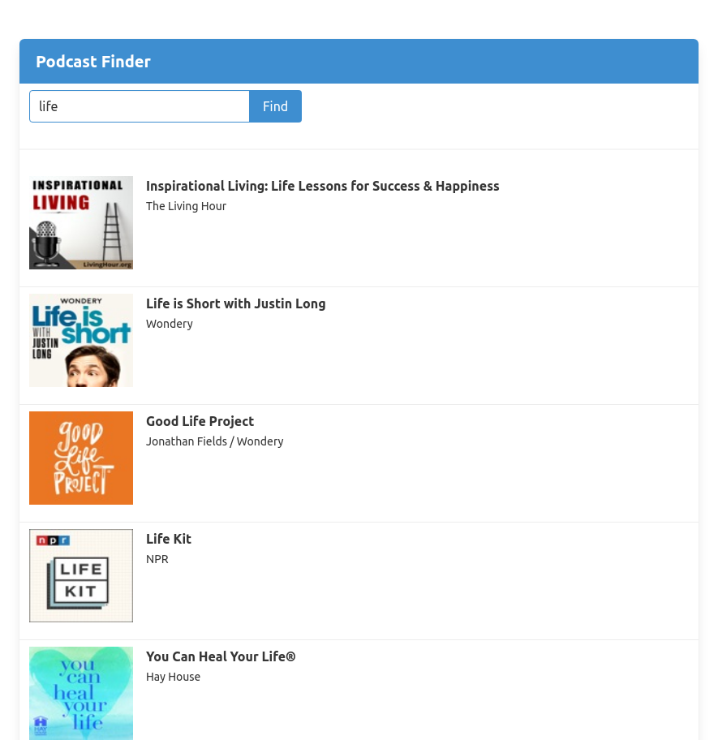
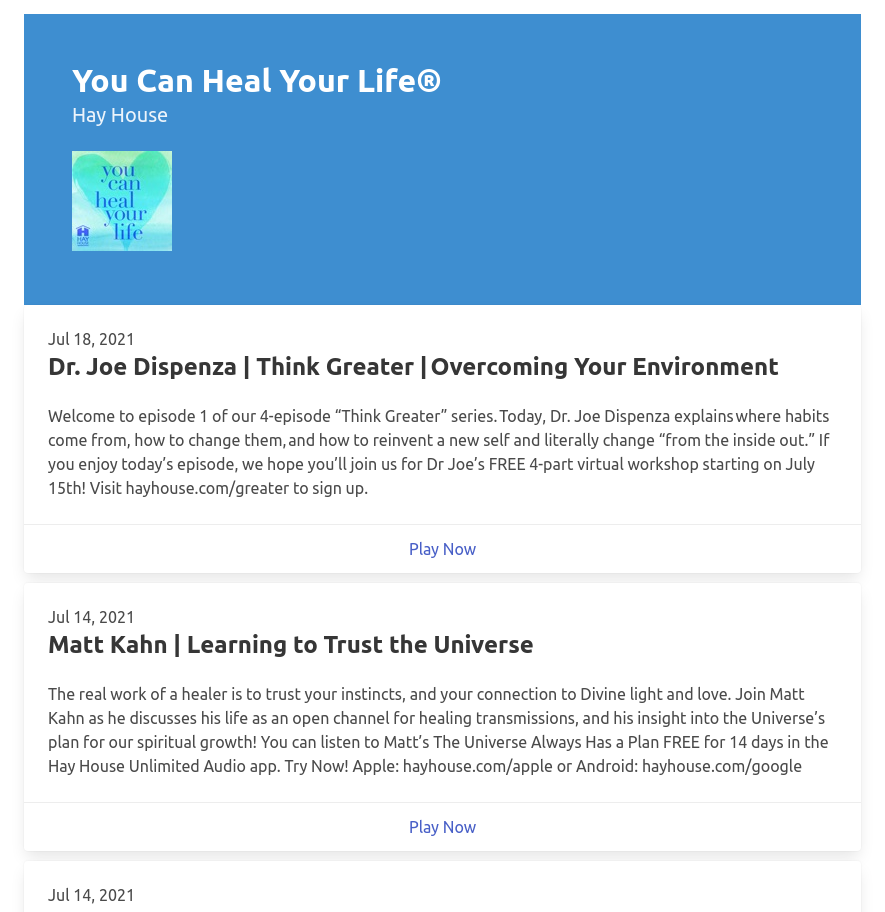

# One CakePHP project a day challenge - Day 07 Podcast Finder

On this project I'm using CakePHP 4 (Model Actions, Http Client, Dependency Injection), Bulma CSS Framework, Itunes Api and Podcasts Feed (XML)

## Steps to create this project

- d3d02be Initial
- 400bc0f Added initial page (no css) template
- 8fa0c2c Added 'fake' itunes podcast client (will replace with real one)
- 5f087d9 Added index action and using temp client
- 6a10c7a Migration for podcasts table
  ```
  bin/cake bake migration CreatePodcasts feed_url artist_name collection_name collection_id:biginteger artwork_url_100 artwork_url_600
  bin/cake migrations migrate
  ```
- e587d54 Baked Podcasts model
  ```
  bin/cake bake model Podcasts
  ```
- 7bccbab Move logic to a model action class
- b061d87 Save Podcast on local database on search
- 3db91d5 Added page to read episodes from Podcast feed
- bc70429 Fix arg type to allow null
- 8dc6c8d Setup Bulma CSS Framework
- aa254fe Style finder page with Bulma CSS Framework
- b02bda8 Fixed url
- 27a3c10 Style episodes page with Bulma CSS Framework
- 3b78821 Remove html tags from episode description
- b2e78a0 Using real itunes podcast webservice
- e7deaaf Dependency Injection: Added Model Logic classes to container
- 58210ef Dependency Injection: webservice class to container
- a09b250 Populate input text

## Links

https://bulma.io

https://book.cakephp.org/4/en/development/dependency-injection.html

https://affiliate.itunes.apple.com/resources/documentation/itunes-store-web-service-search-api/


## Main page


## Episodes Page

